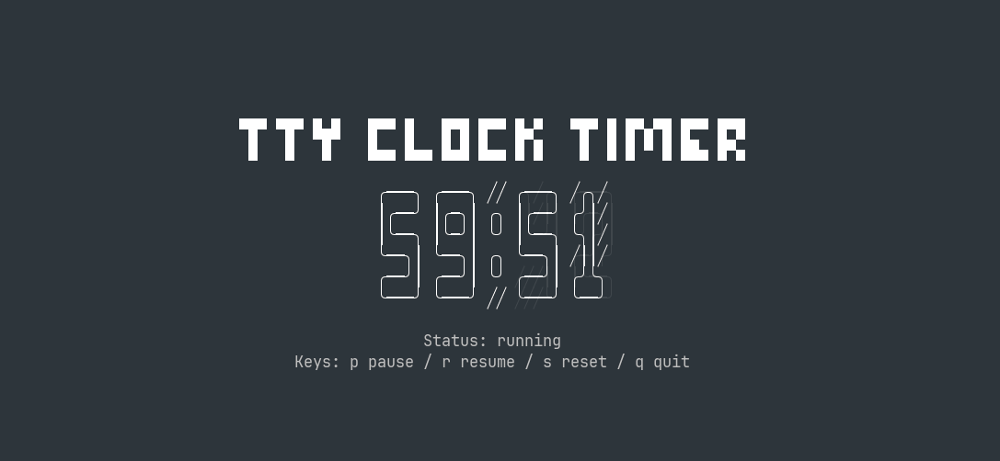

# tty-clock-timer



**A TUI timer built with OpenTUI and Zig.**

Simple. Fast. Offline.

Launches instantly.

Precise minute/second control.

One-key Pause / Resume / Reset.

Usage history is saved automatically.

Interactive history selection and cleanup (`list`, `list --delete`).

Optional finished sound setup (`--setup-sound`).

No network. No tracking. No overhead.

Stay in the terminal. Stay in the moment.

Built with AI-assisted coding tools.

## Architecture Overview

- `core/` (Zig): CLI argument parsing, timer state machine, IPC server, and UI subprocess bootstrap.
- `tui/` (TypeScript + OpenTUI/Solid): rendering, keyboard handling, command plane, and socket client.
- `openspec/`: requirements, design docs, tasks, and change history.
- Core runtime resources come from `main(init: std.process.Init)`: allocator uses `init.gpa`, and I/O uses `init.io`.

## System Flow (ASCII)

```text
┌────────────────────────────────────────────────────────────────────┐
│                         User / Terminal                            │
│                  ttc --minutes 25 / --seconds 90                   │
└────────────────────────────────────────────────────────────────────┘
                               │
                               ▼
┌────────────────────────────────────────────────────────────────────┐
│                         Zig Core (core/)                           │
│ 1) parse args                                                      │
│ 2) init countdown timer                                            │
│ 3) setup unique Unix socket server (TMPDIR, then /tmp fallback)    │
│ 4) spawn TUI process (bun run <entry> -- --socket-path <unique>)   │
└────────────────────────────────────────────────────────────────────┘
                     │                               │
                     │ timer events                  │ commands
                     │ (update_timer,                │ (pause/resume/reset/quit)
                     │  timer_finished, exit)        │
                     ▼                               ▲
┌────────────────────────────────────────────────────────────────────┐
│                  Unix Domain Socket IPC Bridge                     │
└────────────────────────────────────────────────────────────────────┘
                     │                               ▲
                     │ event stream                  │ command stream
                     ▼                               │
┌────────────────────────────────────────────────────────────────────┐
│                    OpenTUI UI (tui/src/index.tsx)                  │
│ - receive events -> update store -> render                         │
│ - key input (p/r/s/q) -> command plane -> socket adapter -> core   │
└────────────────────────────────────────────────────────────────────┘
                               │
                               ▼
┌────────────────────────────────────────────────────────────────────┐
│                        Terminal Rendering                          │
│        countdown (MM:SS), status, finished animation/error         │
└────────────────────────────────────────────────────────────────────┘
```

## Main Interaction Logic

```text
[No args or --help]
  -> Core prints help and exits.

[With --minutes/--seconds]
  -> Core starts timer loop.
  -> Core resolves TUI runtime contract (TTY_CLOCK_TUI_CWD/TTY_CLOCK_TUI_ENTRY/APPDIR).
  -> If TUI connects: use socket command/event flow.
  -> If TUI not connected: fallback stdin path supports q to quit.

[list]
  -> Core loads history from XDG state path.
  -> Core launches bundled prompt helper via bun.
  -> Selected duration starts timer flow.

[list --delete]
  -> Core loads history and opens prompt helper multi-select delete.
  -> Output remaining entries, or "no history" when empty/canceled.

[--setup-sound]
  -> Core enters interactive setup (does not start timer/TUI).
  -> Detect player, launch prompt helper, then write user config.
```

## Requirements

### Running a packaged release
- **bun** ([https://bun.sh](https://bun.sh)) - required for the TUI runtime
- **Platforms**: Linux x86_64 AppImage or macOS Apple Silicon (`arm64`) tarball

### Development Environment
- **zig** nightly (`0.16.0-dev`) - [https://ziglang.org/download](https://ziglang.org/download)
- **bun** - [https://bun.sh](https://bun.sh)

## Quick Start

### Core

```bash
cd core
zig build
zig build run -- --seconds 90
zig build run -- list
zig build run -- list --delete
zig build run -- --setup-sound
zig build test
```

### TUI (Standalone Development)

```bash
cd tui
bun install
bun run dev
```

## Release and Distribution

### Linux x86_64 AppImage

`tty-clock-timer` ships Linux x86_64 AppImage releases, providing a standalone and portable binary for end users.

After downloading the AppImage, make it executable with `chmod +x` and optionally rename it to `ttc` so command examples and help output stay consistent:

```bash
chmod +x tty-clock-timer-<version>-linux-x86_64.AppImage
mv tty-clock-timer-<version>-linux-x86_64.AppImage ttc
./ttc --help
```

### Runtime Artifact Contract

AppImage and development mode share a unified **Core-TUI artifact contract**:

- **Core binary**: `usr/bin/ttc` (the only entrypoint inside the AppImage)
- **TUI runtime root**: `usr/lib/tty-clock-timer/tui` (used by core as the subprocess working directory)
- **TUI entry file**: `index.js` (overridable via `TTY_CLOCK_TUI_ENTRY`)
- **AppRun wrapper**: sets env vars, then delegates to core instead of launching the UI directly

For full contract details, see [packaging/appimage/artifact-contract.md](./packaging/appimage/artifact-contract.md).

### macOS Apple Silicon

macOS releases are versioned tarballs for Apple Silicon only. They require Bun at runtime and must be kept as a complete extracted directory:

```bash
shasum -a 256 -c tty-clock-timer-<version>-macos-arm64.tar.gz.sha256
tar -xzf tty-clock-timer-<version>-macos-arm64.tar.gz
./tty-clock-timer-<version>-macos-arm64/bin/ttc --help
./tty-clock-timer-<version>-macos-arm64/bin/ttc --seconds 90
```

Do not copy only `bin/ttc`; the launcher resolves the Zig core, TUI bundle, prompt helper, and `libopentui.dylib` relative to the extracted directory. The macOS MVP does not include Bun, Intel Mac support, a Universal Binary, Homebrew packaging, codesign, or notarization.

Because the archive is not signed or notarized, macOS may attach a quarantine attribute and block it. First verify the SHA-256 checksum and confirm the archive came from the expected GitHub Release. Only for an artifact you trust, remove quarantine from the extracted directory:

```bash
xattr -dr com.apple.quarantine tty-clock-timer-<version>-macos-arm64
```

For the full layout and packaging commands, see [packaging/macos/](./packaging/macos/).

### Unix Socket IPC and Dynamic Socket Path

Core and TUI communicate bidirectionally over Unix Domain Sockets. To support multiple concurrent instances without collisions, **core generates a unique socket path on every run**. It prefers a valid `TMPDIR` path and falls back to `/tmp/tty-clock-timer-{random_hex}.sock` when the first candidate is empty, unavailable, or too long for a Unix socket address.

For detailed behavior, see [openspec/specs/unix-socket-ipc-bridge/spec.md](./openspec/specs/unix-socket-ipc-bridge/spec.md).

### AppImage Build and Verification

The AppImage packaging workflow has fixed input/output interfaces:

1. **Build core binary**: `./packaging/appimage/scripts/build-core.sh`
2. **Package AppImage**: `APPIMAGE_VERSION=<version> ./packaging/appimage/scripts/package-appimage.sh`
3. **Verify AppImage**: `APPIMAGE_VERSION=<version> ./packaging/appimage/scripts/verify-artifact.sh`
4. **MVP smoke tests** (optional): validate behavior with `mvp-smoke.ts` or `timer-smoke.ts`

For full steps and release playbook details, see the [packaging/appimage/](./packaging/appimage/) directory.

### macOS Build and Verification

The macOS workflow has matching build/package/verify interfaces:

1. **Build and stage runtime**: `MACOS_VERSION=<version> ./packaging/macos/scripts/build-runtime.sh`
2. **Package tarball + checksum**: `MACOS_VERSION=<version> ./packaging/macos/scripts/package-macos.sh`
3. **Verify layout, dylib, IPC, and controlled exit**: `MACOS_VERSION=<version> ./packaging/macos/scripts/verify-artifact.sh`
4. **Verify failure diagnostics**: `MACOS_VERSION=<version> ./packaging/macos/scripts/test-failures.sh`

These scripts intentionally reject non-Darwin and non-arm64 hosts.
